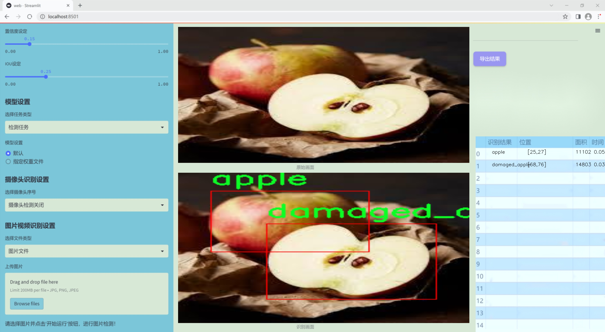
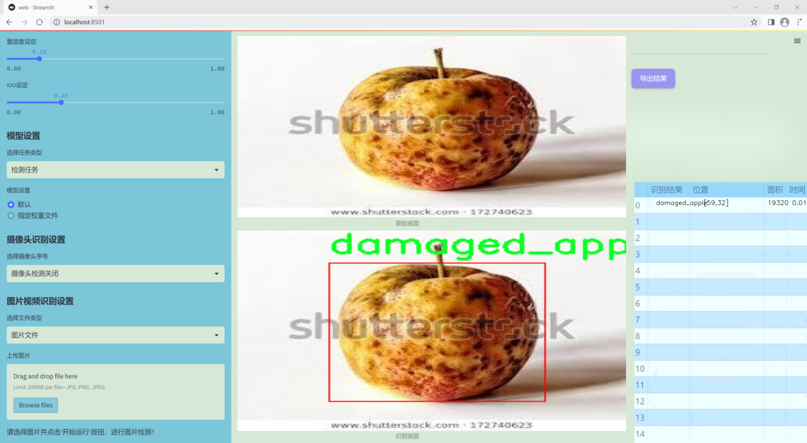
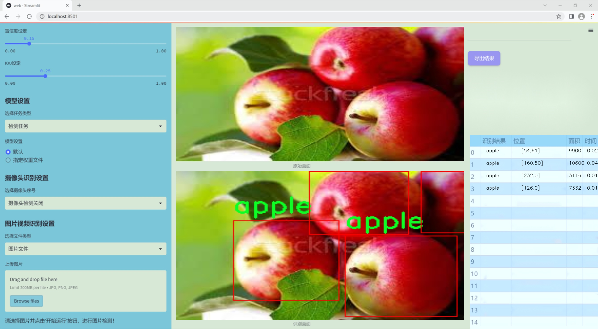
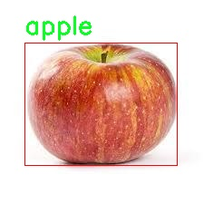
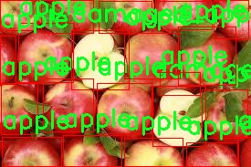
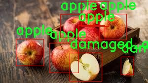
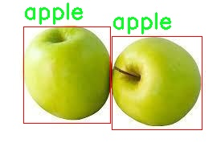
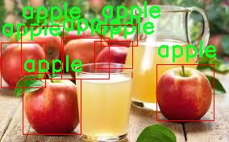

# 改进yolo11-DCNV2-Dynamic等200+全套创新点大全：苹果果实品质检测系统源码＆数据集全套

### 1.图片效果展示







##### 项目来源 **[人工智能促进会 2024.10.22](https://kdocs.cn/l/cszuIiCKVNis)**

##### 注意：由于项目一直在更新迭代，上面“1.图片效果展示”和“2.视频效果展示”展示的系统图片或者视频可能为老版本，新版本在老版本的基础上升级如下：（实际效果以升级的新版本为准）

  （1）适配了YOLOV11的“目标检测”模型和“实例分割”模型，通过加载相应的权重（.pt）文件即可自适应加载模型。

  （2）支持“图片识别”、“视频识别”、“摄像头实时识别”三种识别模式。

  （3）支持“图片识别”、“视频识别”、“摄像头实时识别”三种识别结果保存导出，解决手动导出（容易卡顿出现爆内存）存在的问题，识别完自动保存结果并导出到tempDir中。

  （4）支持Web前端系统中的标题、背景图等自定义修改。

  另外本项目提供训练的数据集和训练教程,暂不提供权重文件（best.pt）,需要您按照教程进行训练后实现图片演示和Web前端界面演示的效果。

### 2.视频效果展示

[2.1 视频效果展示](https://www.bilibili.com/video/BV1cpyZYJEj5/)

### 3.背景

研究背景与意义

随着全球经济的发展和人们生活水平的提高，水果的消费需求日益增长，尤其是苹果作为一种受欢迎的水果，其市场潜力巨大。然而，苹果的品质直接影响消费者的购买决策和市场销售，因此，如何高效、准确地检测苹果果实的品质成为了一个亟待解决的问题。传统的人工检测方法不仅耗时耗力，而且容易受到主观因素的影响，导致检测结果的不一致性和准确性不足。因此，基于计算机视觉和深度学习技术的自动化检测系统应运而生。

在众多深度学习模型中，YOLO（You Only Look Once）系列因其快速和高效的目标检测能力而受到广泛关注。尤其是YOLOv5和YOLOv11等改进版本，凭借其更高的检测精度和更快的推理速度，成为了研究者们的热门选择。本项目旨在基于改进的YOLOv11模型，构建一个高效的苹果果实品质检测系统。该系统将利用一个包含697张图像的数据集，其中包括正常苹果和受损苹果的分类信息，以实现对苹果果实品质的智能化评估。

通过对该系统的研究与开发，不仅可以提高苹果品质检测的效率和准确性，还能为果农和销售商提供科学依据，帮助他们更好地管理果园和优化销售策略。此外，该系统的成功实施也将为其他水果的品质检测提供借鉴，推动农业智能化的发展。因此，本项目不仅具有重要的学术价值，也具备广泛的应用前景，能够为果品行业的可持续发展贡献力量。

### 4.数据集信息展示

##### 4.1 本项目数据集详细数据（类别数＆类别名）

nc: 2
names: ['apple', 'damaged_apple']


该项目为【目标检测】数据集，请在【训练教程和Web端加载模型教程（第三步）】这一步的时候按照【目标检测】部分的教程来训练

##### 4.2 本项目数据集信息介绍

本项目数据集信息介绍

本项目所使用的数据集名为“apples”，旨在为改进YOLOv11的苹果果实品质检测系统提供高质量的训练数据。该数据集专注于苹果果实的视觉特征，通过精确标注的图像数据，帮助模型学习识别和分类不同状态的苹果。数据集中包含两个主要类别：正常的“apple”和受损的“damaged_apple”。这两个类别的划分不仅有助于模型在实际应用中进行准确的品质评估，还能有效提高对苹果果实在不同生长阶段和环境条件下的识别能力。

在数据集的构建过程中，研究团队通过收集来自不同果园和市场的苹果图像，确保了数据的多样性和代表性。这些图像涵盖了各种光照条件、背景和拍摄角度，力求模拟真实世界中可能遇到的各种场景。此外，数据集中的每一张图像都经过精细的标注，确保模型在训练过程中能够准确学习到正常苹果与受损苹果之间的细微差别。这种细致的标注工作为后续的模型训练提供了坚实的基础，确保了检测系统在实际应用中的高效性和可靠性。

通过使用“apples”数据集，改进后的YOLOv11模型将能够更好地适应苹果果实的品质检测任务，不仅提升了检测的准确性，还能在生产和销售环节中发挥重要作用，帮助果农和商家及时识别和处理受损果实，从而降低损失，提高经济效益。总之，本数据集的构建和应用将为苹果果实品质检测领域的研究和实践提供重要支持。











### 5.全套项目环境部署视频教程（零基础手把手教学）

[5.1 所需软件PyCharm和Anaconda安装教程（第一步）](https://www.bilibili.com/video/BV1BoC1YCEKi/?spm_id_from=333.999.0.0&vd_source=bc9aec86d164b67a7004b996143742dc)


[5.2 安装Python虚拟环境创建和依赖库安装视频教程（第二步）](https://www.bilibili.com/video/BV1ZoC1YCEBw?spm_id_from=333.788.videopod.sections&vd_source=bc9aec86d164b67a7004b996143742dc)

### 6.改进YOLOv11训练教程和Web_UI前端加载模型教程（零基础手把手教学）

[6.1 改进YOLOv11训练教程和Web_UI前端加载模型教程（第三步）](https://www.bilibili.com/video/BV1BoC1YCEhR?spm_id_from=333.788.videopod.sections&vd_source=bc9aec86d164b67a7004b996143742dc)


按照上面的训练视频教程链接加载项目提供的数据集，运行train.py即可开始训练



     Epoch   gpu_mem       box       obj       cls    labels  img_size
     1/200     20.8G   0.01576   0.01955  0.007536        22      1280: 100%|██████████| 849/849 [14:42<00:00,  1.04s/it]
               Class     Images     Labels          P          R     mAP@.5 mAP@.5:.95: 100%|██████████| 213/213 [01:14<00:00,  2.87it/s]
                 all       3395      17314      0.994      0.957      0.0957      0.0843

     Epoch   gpu_mem       box       obj       cls    labels  img_size
     2/200     20.8G   0.01578   0.01923  0.007006        22      1280: 100%|██████████| 849/849 [14:44<00:00,  1.04s/it]
               Class     Images     Labels          P          R     mAP@.5 mAP@.5:.95: 100%|██████████| 213/213 [01:12<00:00,  2.95it/s]
                 all       3395      17314      0.996      0.956      0.0957      0.0845

     Epoch   gpu_mem       box       obj       cls    labels  img_size
     3/200     20.8G   0.01561    0.0191  0.006895        27      1280: 100%|██████████| 849/849 [10:56<00:00,  1.29it/s]
               Class     Images     Labels          P          R     mAP@.5 mAP@.5:.95: 100%|███████   | 187/213 [00:52<00:00,  4.04it/s]
                 all       3395      17314      0.996      0.957      0.0957      0.0845


###### [项目数据集下载链接](https://kdocs.cn/l/cszuIiCKVNis)

### 7.原始YOLOv11算法讲解


##### YOLOv11三大损失函数

YOLOv11（You Only Look Once）是一种流行的目标检测算法，其损失函数设计用于同时优化分类和定位任务。YOLO的损失函数通常包括几个部分：
**分类损失、定位损失（边界框回归损失）和置信度损失** 。其中，

  1. box_loss（边界框回归损失）是用于优化预测边界框与真实边界框之间的差异的部分。

  2. cls_loss（分类损失）是用于优化模型对目标类别的预测准确性的部分。分类损失确保模型能够正确地识别出图像中的对象属于哪个类别。

  3. dfl_loss（Distribution Focal Loss）是YOLO系列中的一种损失函数，特别是在一些改进版本如YOLOv5和YOLOv7中被引入。它的主要目的是解决目标检测中的类别不平衡问题，并提高模型在处理小目标和困难样本时的性能。

##### 边界框回归损失详解

box_loss（边界框回归损失）是用于优化预测边界框与真实边界框之间的差异的部分。


##### box_loss 的具体意义


##### 为什么需要 box_loss

  * 精确定位：通过最小化中心点坐标损失和宽高损失，模型能够更准确地预测目标的位置和大小。
  * 平衡不同类型的目标：使用平方根来处理宽高损失，可以更好地平衡不同大小的目标，确保小目标也能得到足够的关注。
  * 稳定训练：适当的损失函数设计有助于模型的稳定训练，避免梯度爆炸或消失等问题。

##### 分类损失详解

在YOLO（You Only Look
Once）目标检测算法中，cls_loss（分类损失）是用于优化模型对目标类别的预测准确性的部分。分类损失确保模型能够正确地识别出图像中的对象属于哪个类别。下面是关于cls_loss的详细解读：

##### 分类损失 (cls_loss) 的具体意义

  
分类损失通常使用交叉熵损失（Cross-Entropy
Loss）来计算。交叉熵损失衡量的是模型预测的概率分布与真实标签之间的差异。在YOLO中，分类损失的具体形式如下：


##### 为什么需要 cls_loss

  * 类别识别：cls_loss 确保模型能够正确识别出图像中的目标属于哪个类别。这对于目标检测任务至关重要，因为不仅需要知道目标的位置，还需要知道目标的类型。

  * 多类别支持：通过最小化分类损失，模型可以处理多个类别的目标检测任务。例如，在道路缺陷检测中，可能需要识别裂缝、坑洞、路面破损等多种类型的缺陷。

  * 提高准确性：分类损失有助于提高模型的分类准确性，从而提升整体检测性能。通过优化分类损失，模型可以更好地学习不同类别之间的特征差异。

##### 分布损失详解

`dfl_loss`（Distribution Focal
Loss）是YOLO系列中的一种损失函数，特别是在一些改进版本如YOLOv5和YOLOv7中被引入。它的主要目的是解决目标检测中的类别不平衡问题，并提高模型在处理小目标和困难样本时的性能。下面是对`dfl_loss`的详细解读：

##### DFL Loss 的背景

在目标检测任务中，类别不平衡是一个常见的问题。某些类别的样本数量可能远远多于其他类别，这会导致模型在训练过程中对常见类别的学习效果较好，而对罕见类别的学习效果较差。此外，小目标和困难样本的检测也是一个挑战，因为这些目标通常具有较少的特征信息，容易被忽略或误分类。

为了应对这些问题，研究者们提出了多种改进方法，其中之一就是`dfl_loss`。`dfl_loss`通过引入分布焦点损失来增强模型对困难样本的关注，并改善类别不平衡问题。

##### DFL Loss 的定义

DFL Loss
通常与传统的交叉熵损失结合使用，以增强模型对困难样本的学习能力。其核心思想是通过对每个类别的预测概率进行加权，使得模型更加关注那些难以正确分类的样本。

DFL Loss 的公式可以表示为：


##### DFL Loss 的具体意义**

  * **类别不平衡：** 通过引入平衡因子 α，DFL Loss 可以更好地处理类别不平衡问题。对于少数类别的样本，可以通过增加其权重来提升其重要性，从而提高模型对这些类别的检测性能。
  *  **困难样本：** 通过聚焦参数 γ，DFL Loss 可以让模型更加关注那些难以正确分类的样本。当 
  * γ 较大时，模型会对那些预测概率较低的样本给予更多的关注，从而提高这些样本的分类准确性。
  *  **提高整体性能** ：DFL Loss 结合了传统交叉熵损失的优势，并通过加权机制增强了模型对困难样本的学习能力，从而提高了整体的检测性能。


### 8.200+种全套改进YOLOV11创新点原理讲解

#### 8.1 200+种全套改进YOLOV11创新点原理讲解大全

由于篇幅限制，每个创新点的具体原理讲解就不全部展开，具体见下列网址中的改进模块对应项目的技术原理博客网址【Blog】（创新点均为模块化搭建，原理适配YOLOv5~YOLOv11等各种版本）

[改进模块技术原理博客【Blog】网址链接](https://gitee.com/qunmasj/good)


#### 8.2 精选部分改进YOLOV11创新点原理讲解

###### 这里节选部分改进创新点展开原理讲解(完整的改进原理见上图和[改进模块技术原理博客链接](https://gitee.com/qunmasj/good)【如果此小节的图加载失败可以通过CSDN或者Github搜索该博客的标题访问原始博客，原始博客图片显示正常】

### Gold-YOLO


#### Preliminaries
YOLO系列的中间层结构采用了传统的FPN结构，其中包含多个分支用于多尺度特征融合。然而，它只充分融合来自相邻级别的特征，对于其他层次的信息只能间接地进行“递归”获取。

传统的FPN结构在信息传输过程中存在丢失大量信息的问题。这是因为层之间的信息交互仅限于中间层选择的信息，未被选择的信息在传输过程中被丢弃。这种情况导致某个Level的信息只能充分辅助相邻层，而对其他全局层的帮助较弱。因此，整体上信息融合的有效性可能受到限制。
为了避免在传输过程中丢失信息，本文采用了一种新颖的“聚集和分发”机制（GD），放弃了原始的递归方法。该机制使用一个统一的模块来收集和融合所有Level的信息，并将其分发到不同的Level。通过这种方式，作者不仅避免了传统FPN结构固有的信息丢失问题，还增强了中间层的部分信息融合能力，而且并没有显著增加延迟。


#### 低阶聚合和分发分支 Low-stage gather-and-distribute branch
从主干网络中选择输出的B2、B3、B4、B5特征进行融合，以获取保留小目标信息的高分辨率特征。


#### 高阶聚合和分发分支 High-stage gather-and-distribute branch
高级全局特征对齐模块（High-GD）将由低级全局特征对齐模块（Low-GD）生成的特征{P3, P4, P5}进行融合。


Transformer融合模块由多个堆叠的transformer组成，transformer块的数量为L。每个transformer块包括一个多头注意力块、一个前馈网络（FFN）和残差连接。采用与LeViT相同的设置来配置多头注意力块，使用16个通道作为键K和查询Q的头维度，32个通道作为值V的头维度。为了加速推理过程，将层归一化操作替换为批归一化，并将所有的GELU激活函数替换为ReLU。为了增强变换器块的局部连接，在两个1x1卷积层之间添加了一个深度卷积层。同时，将FFN的扩展因子设置为2，以在速度和计算成本之间取得平衡。


信息注入模块(Information injection module)： 高级全局特征对齐模块（High-GD）中的信息注入模块与低级全局特征对齐模块（Low-GD）中的相同。在高级阶段，局部特征（Flocal）等于Pi，因此公式如下所示：


#### 增强的跨层信息流动 Enhanced cross-layer information flow
为了进一步提升性能，从YOLOv6 中的PAFPN模块中得到启发，引入了Inject-LAF模块。该模块是注入模块的增强版，包括了一个轻量级相邻层融合（LAF）模块，该模块被添加到注入模块的输入位置。为了在速度和准确性之间取得平衡，设计了两个LAF模型：LAF低级模型和LAF高级模型，分别用于低级注入（合并相邻两层的特征）和高级注入（合并相邻一层的特征）。它们的结构如图5(b)所示。为了确保来自不同层级的特征图与目标大小对齐，在实现中的两个LAF模型仅使用了三个操作符：双线性插值（上采样过小的特征）、平均池化（下采样过大的特征）和1x1卷积（调整与目标通道不同的特征）。模型中的LAF模块与信息注入模块的结合有效地平衡了准确性和速度之间的关系。通过使用简化的操作，能够增加不同层级之间的信息流路径数量，从而提高性能而不显著增加延迟。


### 9.系统功能展示

图9.1.系统支持检测结果表格显示

  图9.2.系统支持置信度和IOU阈值手动调节

  图9.3.系统支持自定义加载权重文件best.pt(需要你通过步骤5中训练获得)

  图9.4.系统支持摄像头实时识别

  图9.5.系统支持图片识别

  图9.6.系统支持视频识别

  图9.7.系统支持识别结果文件自动保存

  图9.8.系统支持Excel导出检测结果数据


### 10. YOLOv11核心改进源码讲解

#### 10.1 prepbn.py

以下是对代码的核心部分进行提炼和详细注释的结果：

```python
import torch
import torch.nn as nn

# 定义一个自定义的批量归一化类
class RepBN(nn.Module):
    def __init__(self, channels):
        super(RepBN, self).__init__()
        # alpha是一个可学习的参数，初始化为1
        self.alpha = nn.Parameter(torch.ones(1))
        # 使用PyTorch的BatchNorm1d进行一维批量归一化
        self.bn = nn.BatchNorm1d(channels)

    def forward(self, x):
        # 将输入张量的维度进行转置，以适应BatchNorm1d的输入格式
        x = x.transpose(1, 2)
        # 进行批量归一化，并加上可学习的alpha参数乘以输入x
        x = self.bn(x) + self.alpha * x
        # 再次转置回原来的维度
        x = x.transpose(1, 2)
        return x

# 定义一个线性归一化类
class LinearNorm(nn.Module):
    def __init__(self, dim, norm1, norm2, warm=0, step=300000, r0=1.0):
        super(LinearNorm, self).__init__()
        # 预热阶段的步数
        self.register_buffer('warm', torch.tensor(warm))
        # 当前迭代步数
        self.register_buffer('iter', torch.tensor(step))
        # 总步数
        self.register_buffer('total_step', torch.tensor(step))
        # 初始比例因子
        self.r0 = r0
        # norm1和norm2是两个归一化函数
        self.norm1 = norm1(dim)
        self.norm2 = norm2(dim)

    def forward(self, x):
        if self.training:
            # 如果处于训练模式，并且还有预热步骤
            if self.warm > 0:
                # 预热阶段，逐步减少预热步数
                self.warm.copy_(self.warm - 1)
                # 使用norm1进行归一化
                x = self.norm1(x)
            else:
                # 计算当前的lambda值，用于线性插值
                lamda = self.r0 * self.iter / self.total_step
                if self.iter > 0:
                    # 迭代步数减少
                    self.iter.copy_(self.iter - 1)
                # 分别使用norm1和norm2进行归一化
                x1 = self.norm1(x)
                x2 = self.norm2(x)
                # 线性插值
                x = lamda * x1 + (1 - lamda) * x2
        else:
            # 如果不在训练模式，直接使用norm2进行归一化
            x = self.norm2(x)
        return x
```

### 代码核心部分分析：
1. **RepBN类**：
   - 该类实现了一种自定义的批量归一化方法，通过引入一个可学习的参数`alpha`来增强模型的表达能力。
   - 在`forward`方法中，输入数据首先被转置以适应`BatchNorm1d`的输入格式，然后进行批量归一化处理，最后加上`alpha`乘以输入数据，最后再转置回原来的格式。

2. **LinearNorm类**：
   - 该类实现了一种线性归一化方法，支持在训练过程中逐步过渡到另一种归一化方式。
   - 通过`warm`参数控制预热阶段的步数，预热期间只使用`norm1`进行归一化。
   - 在预热结束后，使用`norm1`和`norm2`进行线性插值，`lamda`控制插值的比例，逐步过渡到`norm2`。
   - 在不训练时，直接使用`norm2`进行归一化。

### 总结：
这段代码定义了两个自定义的神经网络模块，分别用于批量归一化和线性归一化，具有一定的灵活性和可扩展性，适用于深度学习模型的训练和推理过程。

这个文件定义了两个神经网络模块：`RepBN` 和 `LinearNorm`，它们都是基于 PyTorch 框架构建的。

首先，`RepBN` 类是一个自定义的批量归一化（Batch Normalization）模块。它的构造函数接收一个参数 `channels`，表示输入数据的通道数。在初始化时，它创建了一个可学习的参数 `alpha`，并实例化了一个标准的 `BatchNorm1d` 层。`forward` 方法定义了前向传播的过程。输入 `x` 首先进行维度转换（将第二维和第三维交换），然后通过批量归一化层进行处理，最后将归一化后的结果与 `alpha` 乘以原始输入相加，最后再进行一次维度转换。这个模块的设计意图是通过引入可学习的参数 `alpha` 来增强模型的表达能力。

接下来是 `LinearNorm` 类，它实现了一个线性归一化模块。构造函数接收多个参数，包括 `dim`（输入的维度）、`norm1` 和 `norm2`（两个归一化函数）、`warm`（预热步数）、`step`（总步数）和 `r0`（初始比例因子）。在初始化时，它使用 `register_buffer` 方法注册了一些张量，以便在模型训练时保持这些值的状态。`forward` 方法实现了前向传播的逻辑。在训练模式下，如果还有预热步数，则使用 `norm1` 进行归一化；否则，计算一个动态的比例因子 `lamda`，并使用 `norm1` 和 `norm2` 进行归一化，最后将它们按照 `lamda` 的比例进行线性组合。如果不在训练模式下，则直接使用 `norm2` 进行归一化。这个模块的设计允许在训练过程中动态调整归一化的方式，从而提高模型的适应性。

总体而言，这两个模块的设计都旨在增强神经网络的性能，特别是在处理高维数据时，通过引入可学习的参数和动态调整的归一化策略来提高模型的表达能力和稳定性。

#### 10.2 orepa.py

以下是提取后的核心代码部分，并附上详细的中文注释：

```python
import torch
import torch.nn as nn
import torch.nn.functional as F
import numpy as np

# 定义一个OREPA模块
class OREPA(nn.Module):
    def __init__(self, in_channels, out_channels, kernel_size=3, stride=1, padding=None, groups=1, dilation=1, act=True):
        super(OREPA, self).__init__()
        
        # 初始化参数
        self.in_channels = in_channels
        self.out_channels = out_channels
        self.kernel_size = kernel_size
        self.stride = stride
        self.groups = groups
        self.dilation = dilation
        
        # 激活函数的选择
        self.nonlinear = nn.ReLU() if act else nn.Identity()
        
        # 权重参数的初始化
        self.weight_orepa_origin = nn.Parameter(torch.Tensor(out_channels, in_channels // groups, kernel_size, kernel_size))
        nn.init.kaiming_uniform_(self.weight_orepa_origin)  # 使用Kaiming初始化
        
        # 定义其他权重参数
        self.weight_orepa_avg_conv = nn.Parameter(torch.Tensor(out_channels, in_channels // groups, 1, 1))
        nn.init.kaiming_uniform_(self.weight_orepa_avg_conv)
        
        self.weight_orepa_1x1 = nn.Parameter(torch.Tensor(out_channels, in_channels // groups, 1, 1))
        nn.init.kaiming_uniform_(self.weight_orepa_1x1)

        # 初始化向量
        self.vector = nn.Parameter(torch.Tensor(3, out_channels))
        nn.init.constant_(self.vector[0, :], 0.5)  # origin
        nn.init.constant_(self.vector[1, :], 0.5)  # avg
        nn.init.constant_(self.vector[2, :], 0.0)  # 1x1

    def weight_gen(self):
        # 生成权重
        weight_orepa_origin = self.weight_orepa_origin * self.vector[0, :].view(-1, 1, 1, 1)
        weight_orepa_avg = self.weight_orepa_avg_conv * self.vector[1, :].view(-1, 1, 1, 1)
        weight_orepa_1x1 = self.weight_orepa_1x1 * self.vector[2, :].view(-1, 1, 1, 1)

        # 合并所有权重
        weight = weight_orepa_origin + weight_orepa_avg + weight_orepa_1x1
        return weight

    def forward(self, inputs):
        # 前向传播
        weight = self.weight_gen()  # 生成权重
        out = F.conv2d(inputs, weight, stride=self.stride, padding=self.kernel_size // 2, dilation=self.dilation, groups=self.groups)
        return self.nonlinear(out)  # 应用激活函数

# 定义一个卷积层与批归一化的组合
class ConvBN(nn.Module):
    def __init__(self, in_channels, out_channels, kernel_size, stride=1, padding=0, dilation=1, groups=1):
        super().__init__()
        self.conv = nn.Conv2d(in_channels, out_channels, kernel_size, stride=stride, padding=padding, dilation=dilation, groups=groups, bias=False)
        self.bn = nn.BatchNorm2d(out_channels)  # 批归一化

    def forward(self, x):
        return self.bn(self.conv(x))  # 先卷积再批归一化

# 定义一个RepVGG模块
class RepVGGBlock_OREPA(nn.Module):
    def __init__(self, in_channels, out_channels, kernel_size=3, stride=1, padding=None, groups=1, act=True):
        super(RepVGGBlock_OREPA, self).__init__()
        
        # 初始化参数
        self.in_channels = in_channels
        self.out_channels = out_channels
        self.groups = groups
        
        # 激活函数的选择
        self.nonlinearity = nn.ReLU() if act else nn.Identity()
        
        # 定义OREPA模块
        self.rbr_dense = OREPA(in_channels, out_channels, kernel_size=kernel_size, stride=stride, groups=groups)
        self.rbr_1x1 = ConvBN(in_channels, out_channels, kernel_size=1, stride=stride, groups=groups)

    def forward(self, inputs):
        # 前向传播
        out1 = self.rbr_dense(inputs)  # 通过OREPA模块
        out2 = self.rbr_1x1(inputs)    # 通过1x1卷积
        out = out1 + out2              # 合并输出
        return self.nonlinearity(out)  # 应用激活函数
```

### 代码注释说明：
1. **OREPA类**：这是一个自定义的卷积模块，包含多个不同的卷积权重，通过`weight_gen`方法生成最终的卷积权重。
2. **ConvBN类**：这是一个简单的卷积层和批归一化层的组合，便于在模型中使用。
3. **RepVGGBlock_OREPA类**：这是一个复合模块，结合了OREPA和1x1卷积，通过前向传播将它们的输出相加。

这些核心部分是实现深度学习模型中卷积操作的基础，适用于多种计算机视觉任务。

这个程序文件 `orepa.py` 实现了一种名为 OREPA（Orthogonal Reparameterization for Efficient Convolution）的卷积神经网络模块，主要用于深度学习中的卷积操作。该模块包含多个类和函数，主要用于构建和优化卷积层的权重。

首先，文件导入了必要的库，包括 PyTorch 和 NumPy。接着，定义了一些辅助函数，例如 `transI_fusebn` 和 `transVI_multiscale`，用于处理卷积核和批归一化（Batch Normalization）层的融合，以及对卷积核进行多尺度填充。

`OREPA` 类是核心模块，继承自 `nn.Module`。在初始化方法中，定义了输入输出通道、卷积核大小、步幅、填充、分组卷积等参数。根据是否在部署模式下，构建相应的卷积层。若不在部署模式下，初始化多个卷积权重参数，并使用 Kaiming 初始化方法对其进行初始化。该类还包含一个 `weight_gen` 方法，用于生成最终的卷积权重，通过加权组合不同的卷积核。

`OREPA_LargeConv` 类实现了一个大卷积层，允许使用更大的卷积核，并且可以在部署模式下直接使用标准的卷积层。它的权重生成逻辑与 `OREPA` 类似，但在层数和卷积结构上有所不同。

`ConvBN` 类实现了带有批归一化的卷积层。根据是否在部署模式下，选择使用标准卷积或卷积加批归一化的组合。

`OREPA_3x3_RepVGG` 类是一个特定的 OREPA 模块，专门用于 3x3 卷积，结合了多种卷积结构。它的权重生成方法与 `OREPA` 类似，支持多种分支的组合。

`RepVGGBlock_OREPA` 类则是一个更高层次的模块，结合了多个 OREPA 模块和 1x1 卷积，形成一个完整的卷积块。它还支持使用 Squeeze-and-Excitation（SE）注意力机制来增强特征表达能力。

整个文件的设计旨在通过高效的卷积权重重参数化，提升模型的性能和计算效率，同时保持灵活性以适应不同的应用场景。各个模块之间通过组合和重用，实现了灵活的网络结构设计。

#### 10.3 pkinet.py

以下是经过简化和注释的核心代码部分，保留了主要的功能和结构：

```python
import math
import torch
import torch.nn as nn

class DropPath(nn.Module):
    """实现随机深度（Drop Path）机制的模块，适用于残差块的主路径。"""
    
    def __init__(self, drop_prob: float = 0.1):
        super().__init__()
        self.drop_prob = drop_prob  # 路径被置零的概率

    def forward(self, x: torch.Tensor) -> torch.Tensor:
        """前向传播，应用随机深度机制。"""
        if self.drop_prob == 0. or not self.training:
            return x  # 如果不训练或概率为0，直接返回输入
        keep_prob = 1 - self.drop_prob
        random_tensor = keep_prob + torch.rand(x.shape[0], 1, 1, 1, device=x.device)  # 生成随机张量
        output = x.div(keep_prob) * random_tensor.floor()  # 进行随机深度的计算
        return output

class ConvFFN(nn.Module):
    """使用卷积模块实现的多层感知机（Feed Forward Network）。"""
    
    def __init__(self, in_channels: int, out_channels: int, hidden_channels_scale: float = 4.0):
        super().__init__()
        hidden_channels = int(in_channels * hidden_channels_scale)  # 隐藏层通道数
        
        # 定义前向传播的层
        self.ffn_layers = nn.Sequential(
            nn.Conv2d(in_channels, hidden_channels, kernel_size=1),  # 1x1卷积
            nn.ReLU(),  # 激活函数
            nn.Conv2d(hidden_channels, out_channels, kernel_size=1)  # 1x1卷积
        )

    def forward(self, x):
        return self.ffn_layers(x)  # 前向传播

class PKIBlock(nn.Module):
    """多核Inception模块，包含多个卷积层和一个前馈网络。"""
    
    def __init__(self, in_channels: int, out_channels: int):
        super().__init__()
        self.conv1 = nn.Conv2d(in_channels, out_channels, kernel_size=1)  # 1x1卷积
        self.conv2 = nn.Conv2d(out_channels, out_channels, kernel_size=3, padding=1)  # 3x3卷积
        self.ffn = ConvFFN(out_channels, out_channels)  # 前馈网络

    def forward(self, x):
        x = self.conv1(x)  # 通过第一个卷积层
        x = self.conv2(x)  # 通过第二个卷积层
        x = self.ffn(x)  # 通过前馈网络
        return x

class PKINet(nn.Module):
    """多核Inception网络的实现。"""
    
    def __init__(self):
        super().__init__()
        self.stem = nn.Conv2d(3, 32, kernel_size=3, stride=2, padding=1)  # 网络的初始卷积层
        self.block1 = PKIBlock(32, 64)  # 第一个PKI块
        self.block2 = PKIBlock(64, 128)  # 第二个PKI块

    def forward(self, x):
        x = self.stem(x)  # 通过初始卷积层
        x = self.block1(x)  # 通过第一个PKI块
        x = self.block2(x)  # 通过第二个PKI块
        return x

def PKINET_T():
    """创建一个T版本的PKINet模型。"""
    return PKINet()

if __name__ == '__main__':
    model = PKINET_T()  # 实例化模型
    inputs = torch.randn((1, 3, 640, 640))  # 创建输入张量
    res = model(inputs)  # 前向传播
    print(res.size())  # 输出结果的尺寸
```

### 代码说明：
1. **DropPath**: 实现了随机深度的机制，允许在训练过程中随机丢弃某些路径，从而增强模型的泛化能力。
2. **ConvFFN**: 定义了一个简单的前馈网络，使用卷积层进行特征转换。
3. **PKIBlock**: 实现了一个多核Inception模块，包含多个卷积层和前馈网络，负责特征提取。
4. **PKINet**: 定义了整个网络结构，包括初始卷积层和多个PKI块。
5. **主程序**: 创建了一个PKINet模型实例，并对随机输入进行前向传播，输出结果的尺寸。

这个程序文件 `pkinet.py` 实现了一个名为 PKINet 的深度学习模型，主要用于图像处理任务。它的设计灵感来自于多核（Poly Kernel）卷积和注意力机制，采用了多种模块化的结构，便于扩展和修改。

首先，文件导入了一些必要的库，包括 `torch` 和 `torch.nn`，并尝试从其他库中导入一些组件，例如 `ConvModule` 和 `BaseModule`，这些组件用于构建卷积层和基础模块。如果导入失败，则回退到 PyTorch 的基础模块。

接下来，定义了一些辅助函数和类。`drop_path` 函数实现了随机深度（Stochastic Depth）机制，用于在训练过程中随机丢弃某些路径，以提高模型的泛化能力。`DropPath` 类则是对这个函数的封装，方便在模型中使用。

`autopad` 函数用于自动计算卷积的填充，以确保输出的空间维度与输入相同。`make_divisible` 函数确保通道数是可被指定的除数整除，这在某些网络架构中是必要的。

`BCHW2BHWC` 和 `BHWC2BCHW` 类用于在不同的张量格式之间转换，方便在不同层之间传递数据。`GSiLU` 类实现了一种新的激活函数，结合了全局平均池化和 Sigmoid 函数。

`CAA` 类实现了上下文锚注意力机制，通过对输入进行平均池化和多层卷积操作来生成注意力因子。`ConvFFN` 类则实现了一个多层感知机（MLP），使用卷积模块构建，包含了层归一化和激活函数。

`Stem` 和 `DownSamplingLayer` 类分别实现了网络的初始层和下采样层，负责处理输入数据并逐步降低其空间维度。`InceptionBottleneck` 类实现了带有 Inception 模块的瓶颈结构，结合了多种卷积核大小的卷积操作，以提取多尺度特征。

`PKIBlock` 类是多核 Inception 块的实现，包含了多个卷积层和注意力机制，支持残差连接和可选的层缩放。`PKIStage` 类则是多个 PKIBlock 的组合，形成网络的一个阶段。

最后，`PKINet` 类是整个网络的核心，定义了网络的结构和前向传播过程。它支持不同的架构设置（如 T、S、B），并根据输入的参数构建不同的网络层次。网络的初始化权重通过 `init_weights` 方法进行，确保各层的参数在训练开始时具有合适的初始值。

在文件的最后，定义了三个函数 `PKINET_T`、`PKINET_S` 和 `PKINET_B`，用于创建不同配置的 PKINet 模型。在主程序中，创建了一个 PKINET_T 模型实例，并对随机生成的输入进行前向传播，输出各层的特征图尺寸。

整体来看，这个文件展示了一个复杂的深度学习模型的实现，利用了多种现代技术和结构，适合用于图像分类、目标检测等任务。

#### 10.4 repvit.py

以下是代码中最核心的部分，并附上详细的中文注释：

```python
import torch.nn as nn
import torch

# 定义RepViTBlock类，表示RepViT模型中的一个块
class RepViTBlock(nn.Module):
    def __init__(self, inp, hidden_dim, oup, kernel_size, stride, use_se, use_hs):
        super(RepViTBlock, self).__init__()
        assert stride in [1, 2]  # 确保步幅只能是1或2

        # 判断是否需要使用恒等映射
        self.identity = stride == 1 and inp == oup
        assert(hidden_dim == 2 * inp)  # 隐藏层维度应为输入维度的两倍

        # 如果步幅为2，构建token混合器和通道混合器
        if stride == 2:
            self.token_mixer = nn.Sequential(
                Conv2d_BN(inp, inp, kernel_size, stride, (kernel_size - 1) // 2, groups=inp),
                SqueezeExcite(inp, 0.25) if use_se else nn.Identity(),
                Conv2d_BN(inp, oup, ks=1, stride=1, pad=0)
            )
            self.channel_mixer = Residual(nn.Sequential(
                Conv2d_BN(oup, 2 * oup, 1, 1, 0),  # 逐点卷积
                nn.GELU() if use_hs else nn.GELU(),  # 激活函数
                Conv2d_BN(2 * oup, oup, 1, 1, 0, bn_weight_init=0),  # 逐点卷积
            ))
        else:
            assert(self.identity)  # 如果步幅为1，必须是恒等映射
            self.token_mixer = nn.Sequential(
                RepVGGDW(inp),  # 使用RepVGGDW模块
                SqueezeExcite(inp, 0.25) if use_se else nn.Identity(),
            )
            self.channel_mixer = Residual(nn.Sequential(
                Conv2d_BN(inp, hidden_dim, 1, 1, 0),  # 逐点卷积
                nn.GELU() if use_hs else nn.GELU(),  # 激活函数
                Conv2d_BN(hidden_dim, oup, 1, 1, 0, bn_weight_init=0),  # 逐点卷积
            ))

    def forward(self, x):
        # 前向传播
        return self.channel_mixer(self.token_mixer(x))

# 定义RepViT类，表示整个RepViT模型
class RepViT(nn.Module):
    def __init__(self, cfgs):
        super(RepViT, self).__init__()
        self.cfgs = cfgs  # 配置反向残差块

        # 构建第一个层
        input_channel = self.cfgs[0][2]
        patch_embed = torch.nn.Sequential(
            Conv2d_BN(3, input_channel // 2, 3, 2, 1),  # 输入通道为3，输出通道为input_channel // 2
            torch.nn.GELU(),
            Conv2d_BN(input_channel // 2, input_channel, 3, 2, 1)  # 输出通道为input_channel
        )
        layers = [patch_embed]  # 将第一个层添加到层列表中

        # 构建反向残差块
        block = RepViTBlock
        for k, t, c, use_se, use_hs, s in self.cfgs:
            output_channel = _make_divisible(c, 8)  # 确保输出通道数可被8整除
            exp_size = _make_divisible(input_channel * t, 8)  # 扩展通道数
            layers.append(block(input_channel, exp_size, output_channel, k, s, use_se, use_hs))  # 添加块
            input_channel = output_channel  # 更新输入通道数
        self.features = nn.ModuleList(layers)  # 将所有层放入ModuleList中

    def forward(self, x):
        # 前向传播，返回特征图
        input_size = x.size(2)
        scale = [4, 8, 16, 32]  # 特征图的缩放比例
        features = [None, None, None, None]  # 初始化特征图列表
        for f in self.features:
            x = f(x)  # 通过每一层
            if input_size // x.size(2) in scale:  # 如果当前特征图的缩放比例在scale中
                features[scale.index(input_size // x.size(2))] = x  # 保存特征图
        return features  # 返回特征图列表

# 辅助函数，确保通道数可被8整除
def _make_divisible(v, divisor, min_value=None):
    if min_value is None:
        min_value = divisor
    new_v = max(min_value, int(v + divisor / 2) // divisor * divisor)
    if new_v < 0.9 * v:
        new_v += divisor
    return new_v
```

### 代码说明：
1. **RepViTBlock类**：实现了RepViT模型中的一个基本块，包含了token混合器和通道混合器的定义。根据步幅的不同，构建不同的网络结构。
2. **RepViT类**：实现了整个RepViT模型的结构，负责将多个RepViTBlock组合在一起，并处理输入数据的前向传播。
3. **_make_divisible函数**：确保通道数是8的倍数，符合模型的设计要求。

以上代码是RepViT模型的核心部分，其他辅助函数和模型配置部分可以根据需要进行扩展和修改。

这个程序文件 `repvit.py` 实现了一个基于深度学习的模型，主要用于图像处理任务。该模型的结构灵感来源于 MobileNetV3 和 Vision Transformer（ViT），并且通过不同的模块组合来提高模型的性能和效率。

首先，文件导入了必要的库，包括 PyTorch 的神经网络模块、NumPy 以及 `timm` 库中的 SqueezeExcite 层。接着，定义了一些公共的模型名称。

在模型的构建过程中，定义了多个辅助函数和类。`replace_batchnorm` 函数用于替换模型中的 BatchNorm 层为 Identity 层，以便在推理时提高速度。`_make_divisible` 函数确保每一层的通道数都是 8 的倍数，这在某些网络架构中是一个常见的要求。

`Conv2d_BN` 类定义了一个包含卷积层和 BatchNorm 层的顺序模块，并且提供了一个 `fuse_self` 方法，用于在推理时将卷积和 BatchNorm 层融合，以减少计算量。

`Residual` 类实现了残差连接，允许输入通过一个子模块并与原始输入相加，支持在训练时使用随机丢弃的机制。`RepVGGDW` 类则实现了一个深度可分离卷积的结构，结合了卷积和 BatchNorm。

`RepViTBlock` 类是模型的核心模块之一，它根据输入的参数配置构建不同的卷积和激活层。该模块支持通道混合和令牌混合，能够有效地处理输入特征。

`RepViT` 类是整个模型的主类，它根据给定的配置构建一系列的层，并在前向传播中返回特征图。模型的配置通过一个列表传递，包含了每个块的参数，如卷积核大小、扩展比例、输出通道数等。

此外，`switch_to_deploy` 方法用于将模型切换到推理模式，调用 `replace_batchnorm` 函数来优化模型结构。

文件中还定义了多个函数（如 `repvit_m0_9`, `repvit_m1_0` 等），用于构建不同版本的 RepViT 模型。这些函数根据不同的配置构建模型，并可以加载预训练的权重。

最后，在 `__main__` 块中，程序创建了一个特定版本的 RepViT 模型，并生成随机输入进行测试，输出每个特征图的尺寸。

总体而言，这个文件实现了一个灵活且高效的深度学习模型，适用于各种图像处理任务，并通过模块化设计使得模型的构建和调整变得更加方便。

注意：由于此博客编辑较早，上面“10.YOLOv11核心改进源码讲解”中部分代码可能会优化升级，仅供参考学习，以“11.完整训练+Web前端界面+200+种全套创新点源码、数据集获取”的内容为准。

### 11.完整训练+Web前端界面+200+种全套创新点源码、数据集获取


# [下载链接：https://mbd.pub/o/bread/Zp2bmZ1s](https://mbd.pub/o/bread/Zp2bmZ1s)